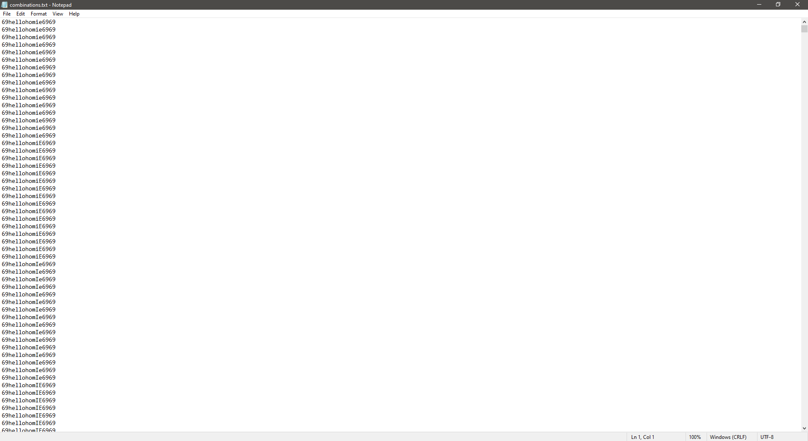
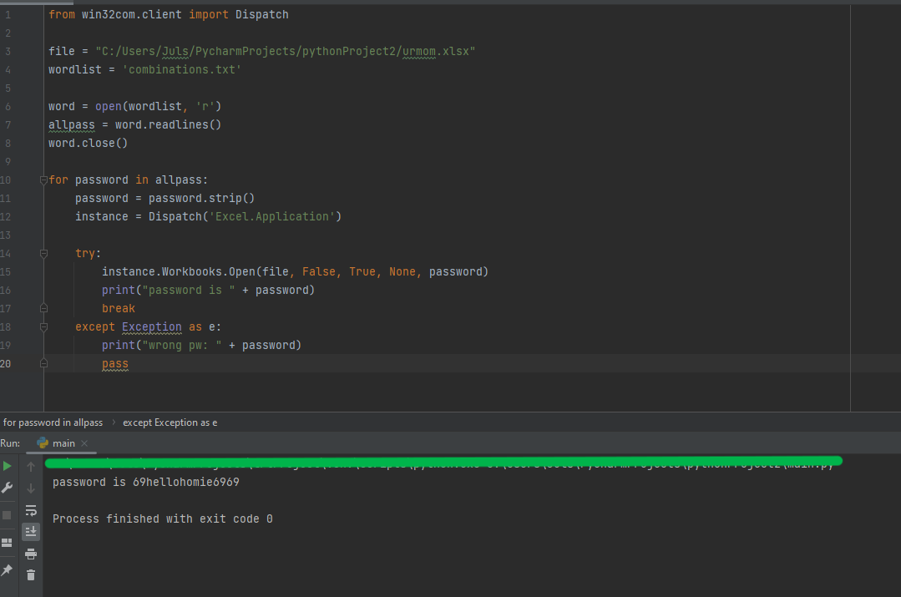

# Bruteforce method of decrypting an excel file

## Step 1:

Use **generate.py** to generate different combinations of the password you remember which is then stored in a text file 

## Step 2:

Run the python script

## DONE!